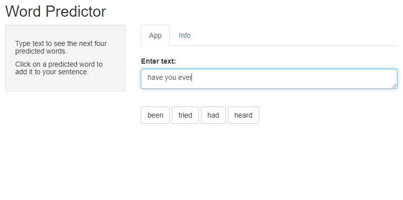

Next Word Predictor
========================================================
author: James Kowalik
date: 2021/10
autosize: true

Completed as part of the Data Science Capstone course in the Johns Hopkins University Data Science Specialization.

The aim of this project was to create and application that allows use of a predictive text model. This was achieved through analysis of text data and natural language processing.

The Data
========================================================
<font size="5">
The data was provided by in the course outline at https://d396qusza40orc.cloudfront.net/dsscapstone/dataset/Coursera-SwiftKey.zip. It is a large dataset including samples of text from twitter, blogs and the news. I accessed, sampled and cleaned the data, with the following process.

- Sampling the data to provide datasets manageable on ordinary CPUs.
- Setting aside a testing set to allow for later model testing and subsequent improvements.
- Tokenizing; whereby which the text strings are 'cleaned'. That is, removing hyperlinks, punctuation, non-alphabetic characters etc.
- Removing profanity.
- Creating 'n-gram' datasets. That is, n-word combination occurrences. In my model I included 2, 3, 4, 5 and 6 word occurrences but, as this can require very large CPU power, I resampled the data at smaller sizes for each higher n ngram and I omitted all word combination occurrences that only occurred once.
</font>

The App
========================================================
<font size="5">


The app is very simple but by providing 4 predictions, the accuracy is high. The apps most convenient feature is providing the 4 predictions as buttons, whereby upon pressing the button corresponding to your word choice, the word is added to the input box and the subsequent 4 predictions appear. This process can be repeated perpetually.
</font>

The Performance
========================================================


```
  Accuracy     Speed
1    0.201 0.3184089
2    0.221 0.3486036
3    0.209 0.3353719
```

Using a testing dataset sampled from the course source files, the app predicts the correct word over 20% of the time with an average speed of less than 0.35 seconds per prediction. 

The three accuracy tests were performed on datasets of size 1000 sampled from the testing set I made at the start of the processing. The speed tests averaged the first 10 prediction's speeds from the three accuracy tests. Each was performed 5 times and averaged again.

Links and Thanks
========================================================

- Link to shiny app: https://jamesk185.shinyapps.io/WordPredictor/

- Link to code and files in github repo: https://github.com/jamesk185/JHU-DSS-Data-Science-Capstone-Project

Thank you to Johns Hopkins University Bloomberg School of Public Health for providing this course and the entire specialization. 

Thank you to Roger D. Peng, Brian Caffo and Jeff Leek, for providing an informative and interesting educational experience.
